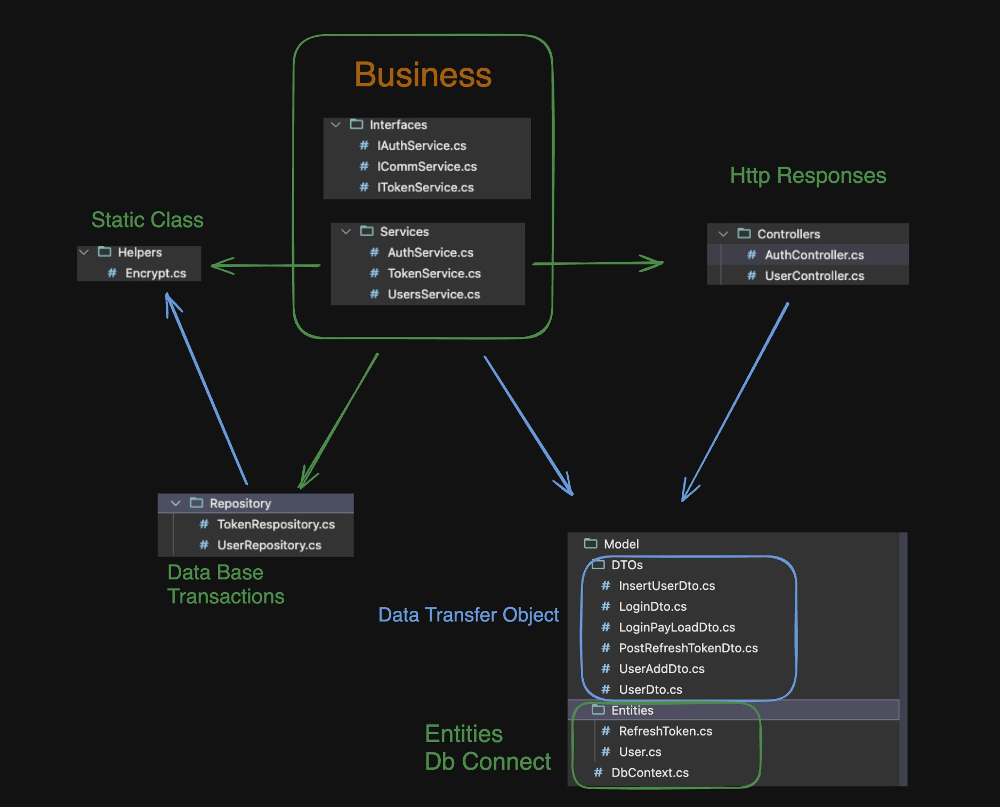
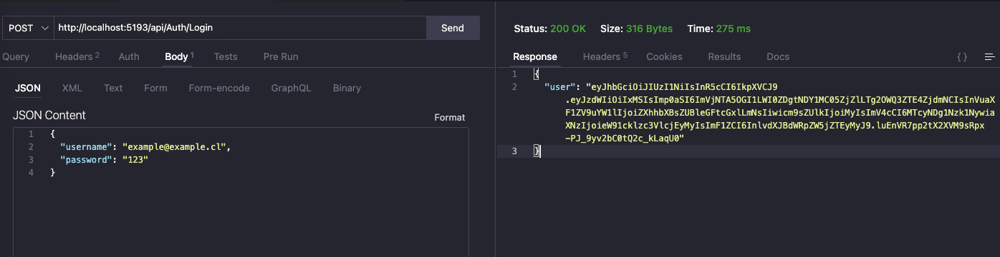
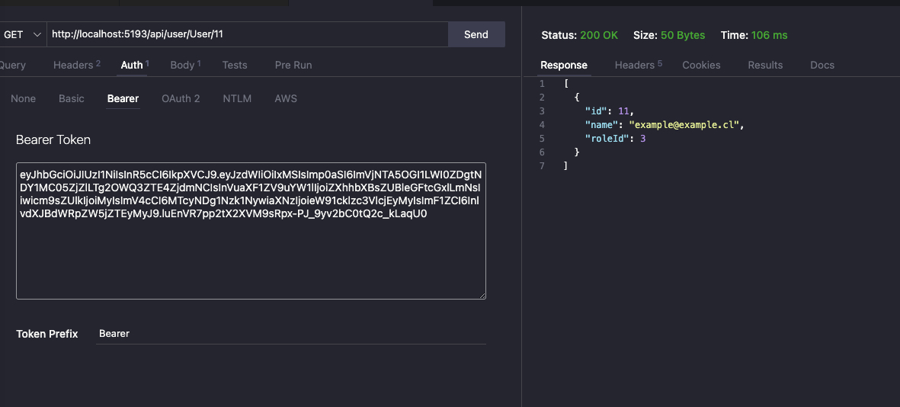
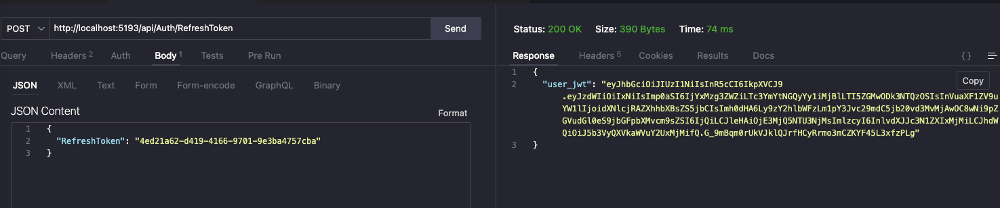
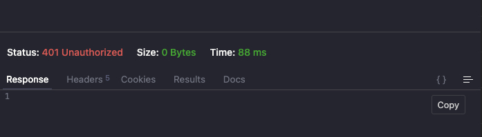
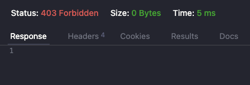
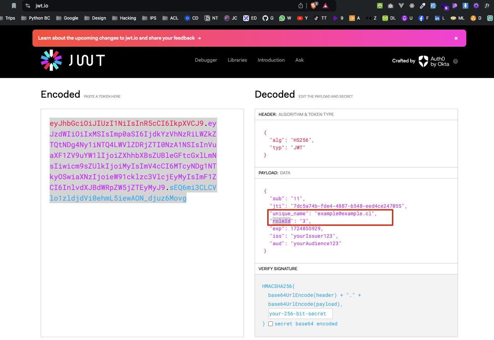
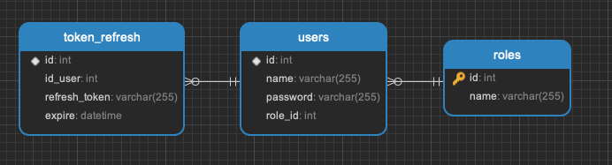
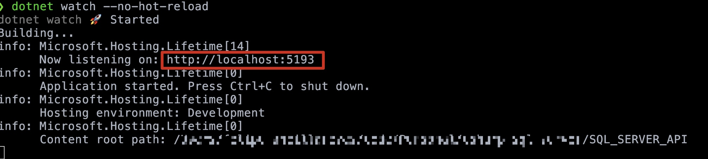

Based on the provided context, here's a possible README description for the project:

**SQL Server API Project**

This project is a C#-based API that interacts with a SQL Server database. The API provides authentication services, utilizing JWT (JSON Web Tokens) for secure authentication.



- Use Examples



**Example Refresh Token**
- Logic with refresh token, this refresh UUID not change if not expire


- Example Bad response with old or null JWT 


- Error if rol is not the admin on add User
  


- JWT example


- Link to SQL DUMP:
[SQL_DUMP](./SQL/dbo.sql)
- Link to Postman File:
[POSTMAN_FILE](./POSTMAN/IvrProject.postman_collection.json)

Docker SQL Server on INTEL/AMD

```bash
docker run -e "ACCEPT_EULA=Y" -e "SA_PASSWORD=123qwe.." -p 1433:1433 --name sql_server_container -d mcr.microsoft.com/mssql/server
```

Docker SQL Server on MAC Mx

```bash
docker run --platform linux/amd64 -e "ACCEPT_EULA=Y" -e "SA_PASSWORD=123qwe.." -p 1433:1433 --name sql_server_container -d mcr.microsoft.com/mssql/server
```

- Execute project 
```bash
dotnet watch --no-hot-reload  
```
or
```bash
dotnet run  
```


**Key Features:**

* Authentication using JWT
* Interaction with a SQL Server database
* Utilizes C# as the primary programming language
* Implements the Repository pattern for data access

**Dependencies:**

* System.Data.SqlClient
* Swashbuckle.AspNetCore (for API documentation)
* Microsoft.AspNetCore.Authentication.JwtBearer
* System.IdentityModel.Tokens.Jwt

**Project Structure:**

The project is organized into the following namespaces:

* `Controllers`: contains controllers that interact with services
* `Interfaces`: contains the Logic required to use on Services
* `Services`: contains the AuthService class, which implements the IAuthService interface
* `DTOs`: contains data transfer object classes (e.g., LoginDto)
* `Model`: contains database model classes
* `Repository`: contains repository classes for data access
* `Helpers`: contains utility classes for miscellaneous tasks

**Getting Started:**

To get started with this project, you'll need to have a SQL Server database set up and configure the connection string in the project settings. You can then run the API and use tools like Postman to test the authentication endpoints.

Note that this is just a starting point, and you may want to add more details to the README as the project evolves.

**Angular Client:**
- Version 10.8.2

```bash
cd Client
npm install
```